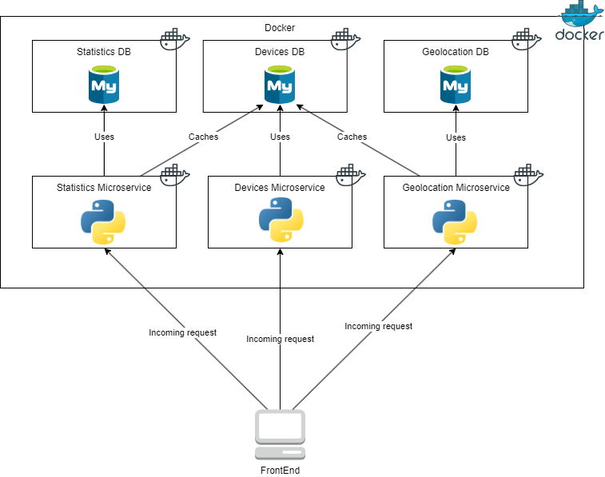
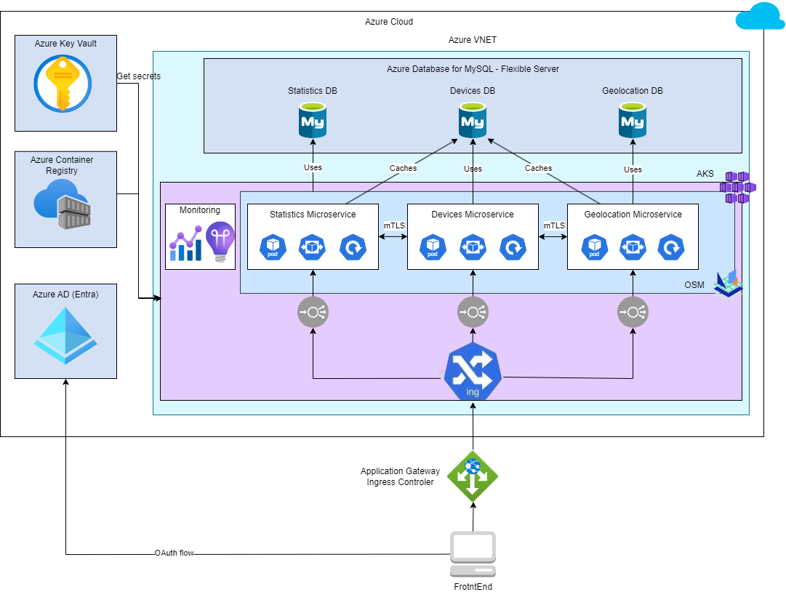

# resilient-six

Kubernetes high availability demo. A complete IoT platform based on 3 services and 3 MySQL databases, with scripts to run it locally (via docker compose), on a local K8s cluster or on a dynamically created Azure Kubernetes Service cluster.

## Architecture
This project features three environments: Docker compose, Kubernetes and Azure AKS.


)



## Running the project

For services, refer to the **services** folder. K8s yaml files can be found in the **kubernetes** folder. Azure cli scripts are located in the **aks** folder.

### vulnerability scanning

Powered by `snyk` - install CLI, e.g. using executables:

```shell
curl https://static.snyk.io/cli/latest/snyk-linux -o snyk
chmod +x ./snyk
mv ./snyk /usr/local/bin/
```

then authenticate your machine:

```shell
snyk auth
```

What can be scanned using `snyk`:

- open-source packages - `snyk test --all-projects --org=<ORG_ID>`
- source code - `snyk code test --org=<ORG_ID>`
- containers - `snyk container test <repository>:<tag> --org=<ORG_ID>`
- IaC (in our case - Azure Bicep) - `snyk iac test --report --org=<ORG_ID>`

where `<ORG_ID>` specifies the Organization ID to run Snyk commands for a specific organization (TBD).

For open-source packages and containers also there is an option to continuously monitor activities:

```shell
# for open-source packages
snyk monitor --all-projects --org=<ORG_ID>

# for containers
snyk container monitor <repository>:<tag> --org=<ORG_ID>
```

**Usage example:**

```shell
(base) ➜  services git:(vuln-scanning) snyk code test

Testing /path/resilient-six/services ...


✔ Test completed

Organization:      jgorczynski
Test type:         Static code analysis
Project path:      /path/resilient-six/services

Summary:

✔ Awesome! No issues were found.


(base) ➜  services git:(vuln-scanning) ✗
```

### STRIDE threat model

Threat modeling has been described using STRIDE framework and can be accessed in the **threat-model** folder. JSON raw diagram file and the latest version of PDF report is available there.
